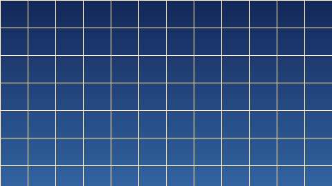

<h1 align="center">Star Wipe for Kdenlive</h1>

<p align="center">
  The classic star wipe as ready-to-install luma files for Kdenlive / MLT —
  plus the generator that made them.
</p>

<p align="center">
  
</p>

<p align="center">
  <a href="LICENSE"></a>
  
  
  
</p>

---

## Install

```bash
git clone https://github.com/toni-schmitt/kdenlive-star-wipe.git
cd kdenlive-star-wipe
./install.sh
```

`install.sh` copies the `.pgm` files into `~/.local/share/kdenlive/lumas/HD` and
`.../PAL` (respecting `$XDG_DATA_HOME`). Nothing else is touched, and existing
lumas are left alone. To uninstall, delete the `star_wipe*.pgm` files from those
folders.

## Use it in Kdenlive

1. Restart Kdenlive so it rescans the luma folders.
2. Put the two clips on two tracks with an overlap — or use a same-track **Mix**.
3. Add a **Wipe** transition on the overlap.
4. In the transition parameters, open the **Luma / Wipe file** dropdown and pick
   **`star_wipe.pgm`**.

Two parameters shape the result:

- **Softness** feathers the edge of the star. `0` gives a hard, graphic edge;
  a little softness reads better on video.
- **Invert** flips it into a *shrinking* star: the outgoing clip collapses into a
  star instead of the incoming clip bursting out of one.

Kdenlive shows the luma folder matching the project profile, so an HD project
lists `lumas/HD` and a DV/PAL project lists `lumas/PAL`. 4K projects use the HD
list too — MLT scales the luma to the frame, so the 1920×1080 files work there
without any loss of edge quality.

## What's included

| File | Look |
| --- | --- |
| **`star_wipe.pgm`** | The classic: five-pointed pentagram star growing from the centre, one arm up |
| `star_wipe_spin.pgm` | Same star, twisting 120° as it grows — the 1980s local-news version |
| `star_wipe_corner.pgm` | Star growing from the lower-left third instead of the centre |
| `star_wipe_4point.pgm` | Four-point sparkle |
| `star_wipe_6point.pgm` | Six-point (hexagram) |
| `star_wipe_8point.pgm` | Eight-point |

Every file ships twice: `lumas/HD` at 1920×1080 with square pixels, and
`lumas/PAL` at 720×576 rendered with PAR 1.0667 so the star stays geometrically
correct on a 4:3 display rather than being squashed by the frame ratio.

<p align="center">
  
  
  
</p>

## How it works

An MLT luma wipe is just a greyscale image. During the transition MLT sweeps a
threshold from black to white, and every pixel darker than the current threshold
has already switched to the incoming clip. So "a star that grows" is an image
whose brightness rises with a **star-shaped** distance from the centre:

```
value(p) = |p| / R(∠p)
```

where `R(θ)` is the radius of the star polygon in direction `θ`, found by
intersecting the ray with the straight arm segment running between an outer and
an inner vertex. Every level set of that function is a scaled copy of the star,
which is exactly what a star wipe is.

Two details matter in practice:

- The image is normalised so that the **last** pixel to be revealed — a frame
  corner — is pure white. Without that, the wipe would run out of gradient and
  finish while the corners still showed the outgoing clip.
- The five-point star uses the true pentagram ratio, `cos 72° / cos 36° = 0.382`,
  which is the shape every star wipe since the 1970s has used.

## Regenerate and customise

```bash
./build.sh                                    # rebuild every luma + the previews

python3 generate_star_wipe.py -o my.pgm -p 5 --spin 200 -g 0.7
python3 generate_star_wipe.py -o my4k.pgm -s 3840x2160 -r 0
python3 make_preview.py my.pgm my.gif         # animated preview of any luma file
```

| Option | Effect |
| --- | --- |
| `-p, --points` | Number of star points |
| `-i, --inner` | Inner/outer radius ratio; lower is spikier (default: true star-polygon ratio) |
| `-r, --rotation` | Orientation in degrees; `-90` (default) points one arm straight up |
| `--spin` | Degrees of twist between centre and edge — the star rotates as it grows |
| `-g, --gamma` | Growth curve: `<1` bursts open then eases, `>1` starts slow |
| `-c, --center` | Star origin in normalised frame coordinates, e.g. `0.2,0.8` |
| `-s, --size` | Output resolution |
| `--par` | Pixel aspect ratio, for anamorphic profiles |
| `--bits` | `8` (default, matching Kdenlive's bundled lumas) or `16` |

`generate_star_wipe.py` is pure standard-library Python 3. Pillow is only needed
for `make_preview.py`.

## Repository layout

```
generate_star_wipe.py   star-wipe luma generator (stdlib only)
make_preview.py         renders an animated GIF the way MLT applies a luma
build.sh                regenerates every luma + preview in this repo
install.sh              copies the lumas into Kdenlive's user luma folders
lumas/HD/*.pgm          1920×1080, square pixels
lumas/PAL/*.pgm         720×576, PAR 1.0667
preview/*.gif           animated previews
```

## A note on "the PowerPoint star wipe"

**PowerPoint has never had a star wipe.** Microsoft's own support answer to exactly 
this question says so, and suggests faking it with a star-shaped mask. PowerPoint's 
*Shape* transition offers Circle, Diamond, Plus, In and Out — no star — and the older
transition set (Wedge, Newsflash, Comb, Checkerboard…) had none either.

The star wipe people remember is the **television** effect: 1970s–80s broadcast
switchers, most famously the *Guiding Light* title sequences, after which it
became shorthand for cheesy local-access video. That is the shape this repo
produces; it simply was never a PowerPoint feature.

## Sources

- [Microsoft Q&A — Star wipe in PowerPoint](https://learn.microsoft.com/en-us/answers/questions/b92fee68-e954-47e4-8ee3-abb5c97c9fbe/star-wipe-in-power-point)
- [Wikipedia — Wipe (transition)](https://en.wikipedia.org/wiki/Wipe_(transition))
- [Kdenlive manual — Wipe transition](https://userbase.kde.org/Kdenlive/Manual/Transitions/Wipe)
- [Kdenlive manual — Download New Wipes](https://docs.kdenlive.org/en/user_interface/menu/settings_menu/download_new_wipes.html)
- [KDE Store — Kdenlive Lumas](https://store.kde.org/browse?cat=185&order=latest)
- [Switch PowerPoint slides with the Shape transition](https://www.free-power-point-templates.com/articles/switch-powerpoint-slides-with-shapes-using-the-shape-transition-effect/)
- [Jonray1 — luma files for video transitions](https://github.com/Jonray1/Luma-files-for-video-transitions-in-Shotcut-and-other-video-editors)

---

<p align="center">
  <a href="https://www.aihonestybadge.com">
    
  </a>
</p>

<p align="center">
  <sub>
    The generator, the luma files and this README were written by Claude (Opus 5)
    in Claude Code, under human direction and review. The star geometry was
    verified by rendering the level sets; the wipe was verified by replicating
    MLT's threshold sweep in <code>make_preview.py</code>, not by running
    <code>melt</code> itself.
  </sub>
</p>

## License

[MIT](LICENSE) — code and luma files alike. Use them in anything, commercial or
not; attribution appreciated but not required.
